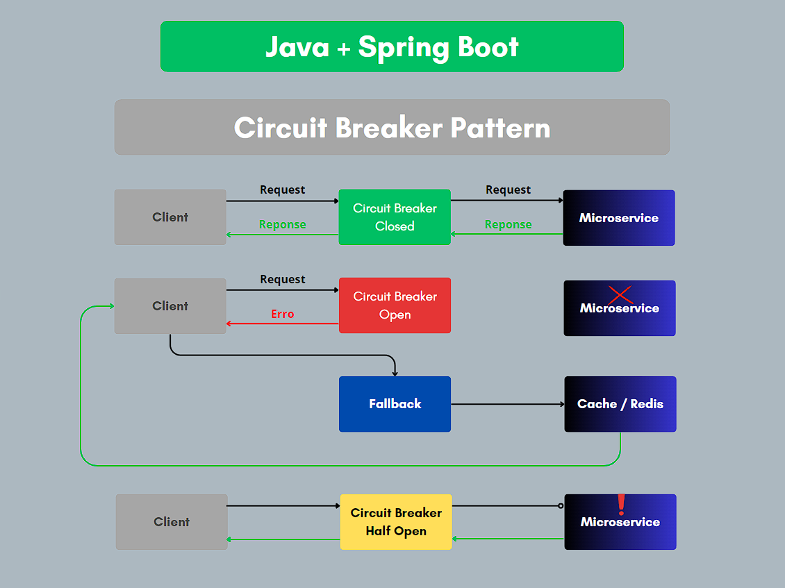
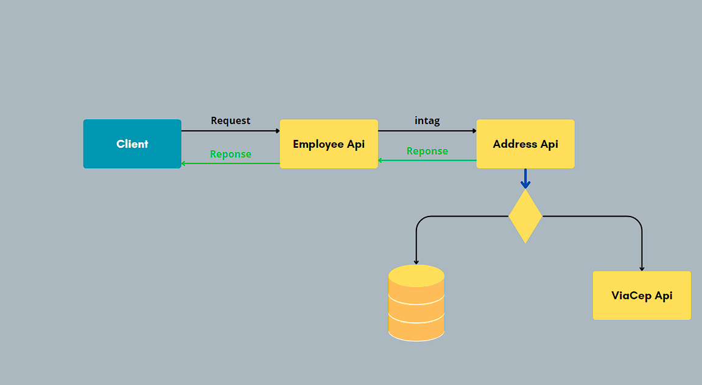

## Employee API   

* API developed with 17 Java and Spring Boot 3.1.9
---
### ⚡ Technologies
These are some of the technologies and tools that I work with:<br>


[](https://spring.io/projects/spring-boot)
[](https://resilience4j.github.io/resilience4j/)
[](https://grafana.com/)
[](https://prometheus.io/)
[](https://swagger.io/)


---
## Circuit Breaker Flow


## Request Flow 


## Configuration for Circuit Breaker

---
```yaml
management:
  tracing:
    sampling:
      probability: 1
  endpoint:
    health:
      show-details: always
  endpoints:
    web:
      exposure:
        include: health,info,metrics,prometheus
  health:
    circuitbreakers:
      enabled: true
    ratelimiters:
      enabled: true
  metrics:
    enable:
      jvm: true
    export:
      prometheus:
        enabled: true
    distribution:
      slo:
        http: '5ms,10ms,25ms,50ms,100ms,200ms,300ms,400ms,500ms,1s,2s'
    tags:
      application: 'ms-employee'
      
#Circuit Breaker
resilience4j:
  circuitbreaker:
    instances:
      address:
        slidingWindowType: COUNT_BASED
        registerHealthIndicator: true
        slidingWindowSize: 6
        failureRateThreshold: 50
        slowCallDurationThreshold: 100
        slowCallRateThreshold: 80
        waitDurationInOpenState: 60s
        permittedNumberOfCallsInHalfOpenState: 3
        enableAutomaticTransitionFromOpenToClosedState: true
        transitionFromOpenToClosedStateOnSuccessfulCall: true

```

### Maven

---

```xml
<!--Dependencies -->
<dependency>
    <groupId>redis.clients</groupId>
    <artifactId>jedis</artifactId>
    <version>4.4.6</version>
</dependency>

<dependency>
<groupId>org.springframework.boot</groupId>
<artifactId>spring-boot-starter-actuator</artifactId>
</dependency>

<dependency>
<groupId>org.springframework.cloud</groupId>
<artifactId>spring-cloud-starter-circuitbreaker-resilience4j</artifactId>
</dependency>

<dependency>
<groupId>org.springframework.boot</groupId>
<artifactId>spring-boot-starter-data-redis</artifactId>
</dependency>

<dependency>
<groupId>io.micrometer</groupId>
<artifactId>micrometer-registry-prometheus</artifactId>
<scope>runtime</scope>
</dependency>
        
<!--Management -->
<dependencyManagement>
<dependencies>
    <dependency>
        <groupId>org.springframework.cloud</groupId>
        <artifactId>spring-cloud-dependencies</artifactId>
        <version>${spring-cloud.version}</version>
        <type>pom</type>
        <scope>import</scope>
    </dependency>
</dependencies>
</dependencyManagement>
```

### Class Java
```java
@Slf4j
@Component
public class AddressApiIntegration {

    @Value("${api.base.url.address}")
    private String baseUrl;

    @Autowired
    private RestTemplate restTemplate;

    @Autowired
    private AddressRedisService redisService;


    @CircuitBreaker(name = "address", fallbackMethod = "getAddressFallback")
    public AddressResponseVO findByZipCode(String zipCode){
        log.info("Start findByZipCode for AddressApiIntegration");
        try {
            String path = "api/v1/addresses/find-by-zipcode?zipCode=";

            String url = baseUrl.concat(path + zipCode);

            var addressResponse = restTemplate.getForObject(url, AddressResponseVO.class);

            redisService.save(addressResponse, zipCode);
            return addressResponse;

        } catch (Exception e) {
            log.error("ERROR: {}", e.getMessage());
            throw new ObjectNotFoundExeption("Address not found.", HttpStatus.FOUND);
        }
    }

    private AddressResponseVO getAddressFallback(String zipCode, Throwable cause){
        log.warn("[WARN] Fallback with id {}", zipCode);
        return redisService.findByZipCode(zipCode);
    }
}

```

---

### Technology References
* [Resilience4j Docs](https://resilience4j.readme.io/docs/circuitbreaker)
* [Spring Boot3](https://docs.spring.io/spring-boot/docs/3.1.11/reference/html/)


